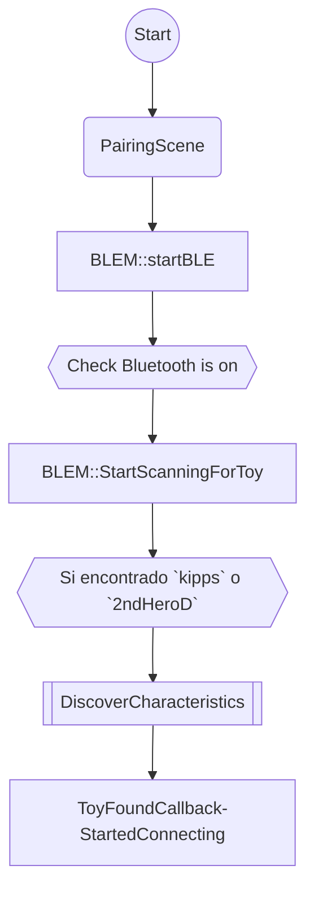
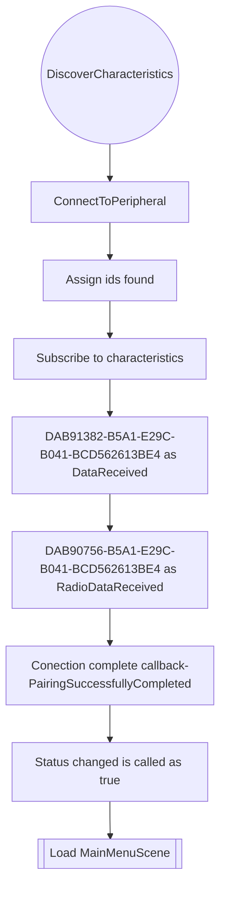
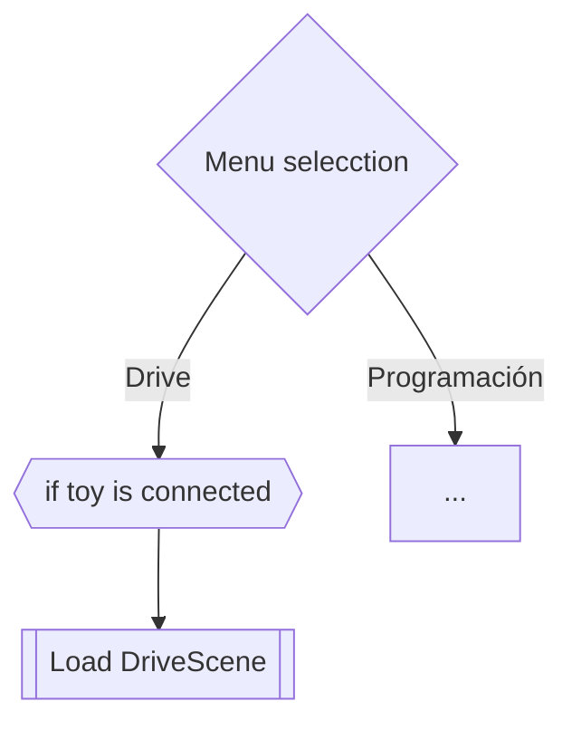
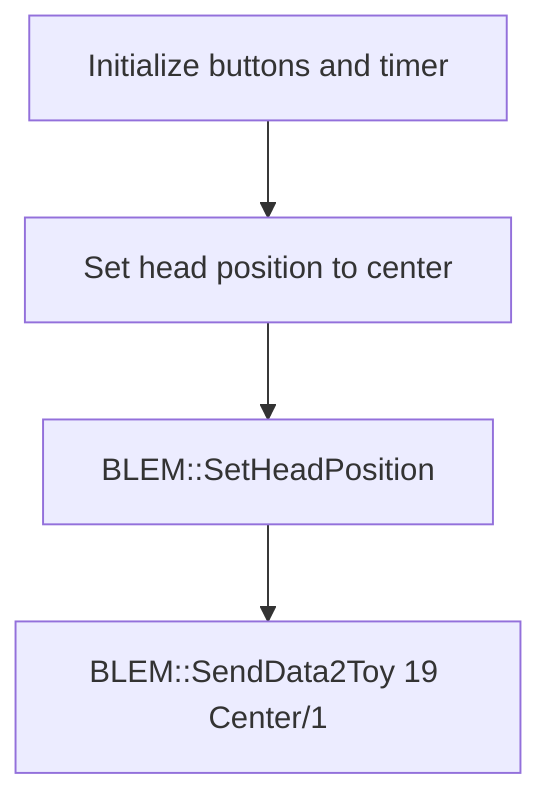

# Flow to drive the toy

## Start - Pairing scene

This is the general flow of execution when trying to drive the toy:

```mermaid
graph TB;
    A((Start)) --> P
    P(PairingScene) --> P1
    P1[BLEM::startBLE] --> P1a
    P1a{{Check Bluetooth is on}} --> P2
    P2[BLEM::StartScanningForToy] --> P2a
    P2a{{Si encontrado `kipps` o `2ndHeroD`}} --> P2b
    P2b[[DiscoverCharacteristics]] --> P2c
    P2c[ToyFoundCallback-StartedConnecting]
    
```

## DiscoverCharacteristics

```mermaid
graph TB;
    D((DiscoverCharacteristics)) --> C
    C[ConnectToPeripheral] --> A
    A[Assign ids found] --> S
    S[Subscribe to characteristics] --> S1
    S1[DAB91382-B5A1-E29C-B041-BCD562613BE4 as DataReceived] --> S2
    S2[DAB90756-B5A1-E29C-B041-BCD562613BE4 as RadioDataReceived] --> CB1
    CB1[Conection complete callback-PairingSuccessfullyCompleted] --> CB2
    CB2[Status changed is called as true] --> L
    L[[Load MainMenuScene]]
```

## Main menu scene

```mermaid
graph TB;
    M{Menu selecction} -- Drive --> D
    M -- Programación --> P
    P[...]
    D{{if toy is connected}} --> D1
    D1[[Load DriveScene]]
```

## Drive scene

```mermaid
graph TB;
    I[Initialize buttons and timer] --> SH
    SH[Set head position to center] --> BLE1
    BLE1[BLEM::SetHeadPosition] --> BLE2
    BLE2[BLEM::SendData2Toy 19 Center/1]

```